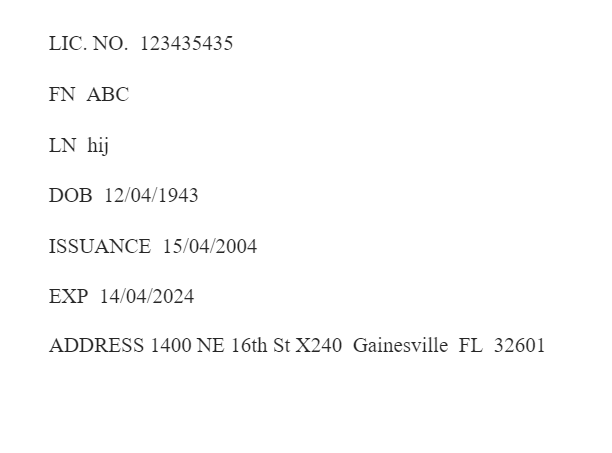
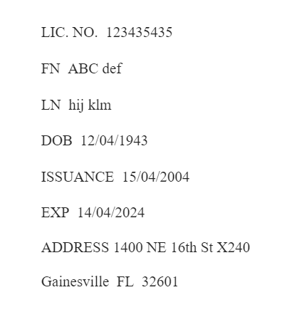
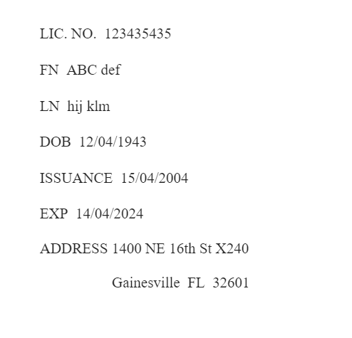

# Driver's License Data Extractor

**Website URL** - [Driver's License Data Extractor](https://license-scanner.onrender.com)

This web application is designed to extract information from a driver's license either by uploading an image or using a webcam to capture the license directly. In cases where the data extracted from an image captured via webcam is not accurate, it is recommended to use the Upload File feature. This is due to the fact that webcam images may not always be of the highest quality. Uploading a higher quality image of the driver's license can significantly improve the precision of the data extraction process.

## Architecture and Requirements

The application follows a client-server architecture with a frontend and backend.
- Frontend: A single-page application that provides interactive UI components for uploading or capturing images and displaying the extracted data. 
- Backend: A server that receives the image, processes it to extract information, and returns the data to the frontend.

## Technologies Used

### 1. For serverside backend development :
- Node.js and Express for server setup.
- node package manager (npm) to install all Node.js dependencies listed in package.json.
- PaddleOCR, PaddlePaddle and opencv-python libraries for extracting text from image (optical character recognition).
- Python (preferably version 3.10 or another version verified to work with PaddlePaddle and PaddleOCR) and use the requirements.txt file to install all necessary Python dependencies.

### 2. For client side frontend development:
- JavaScript for dynamic content and handling user interactions.
- HTML5 and CSS3 for layout and styling. 
- Webcam API for capturing images from the user's webcam.

### 3. Virtual environment
- Set up a virtual environment (venv) that encapsulates all the necessary Python libraries and modules with the required python version.

### 4. Dockerfile

- Construct a Dockerfile with all the necessary instructions to build a container. This includes establishing a virtual environment within the container, installing all required dependencies, configuring it for deployment, and ensuring the service operates smoothly.

## Development Obstacles

### 1. Text Extraction Accuracy
- **Obstacle**: The project initially utilized the Tesseract OCR library with the Sharp image processing library in a Node.js environment for text extraction from images. However, the results were unsatisfactory, with poor accuracy and frequent failures in text recognition.
- **Solution**: To enhance text extraction accuracy, the project transitioned to a Python-based OCR library known for its superior performance. This required spawning a child process from the Node.js API service to execute the Python script and retrieve the extracted text, introducing an inter-language integration.

### 2. Python Version Compatibility with PaddleOCR
- **Obstacle**: Initially faced difficulties installing PaddleOCR, which seemed unresponsive without clear errors.
- **Solution**: Investigation revealed PaddleOCR's incompatibility with the latest Python versions. It was discovered that PaddleOCR is only compatible with Python 3.10, 3.7, and a few earlier versions. Adjusting the Python environment to a compatible version resolved the issue.

### 3. Docker Deployment
- **Obstacle**: Faced issues with Docker. The problem was with the libraries required for text extraction; they needed to download additional data every time the service ran, which not only slowed things down but also caused a segmentation fault, leading to confusion.
- **Solution**: After some research, I learned that I could pre-download these necessary files and have them available locally. This way, when the service ran, it didn't need to download anything on the fly, which solved the speed issue and the segmentation fault. However, Docker didn't provide clear error messages, so figuring this out took some time.

## Assumptions

- **Image Quality**: The accuracy of text extraction heavily depends on the image's clarity. Assumed users have access to decent-quality cameras and well-lit environments.
- **License Variations**: Driver's licenses vary significantly across regions in layout and information presented. The current version targets a specific format. 
- The format and labels allowed for these fields are given below. All field labels are case-insensitive.
  - **License Number**
    - Allowed labels : `DL, ID, DLN, LIC. NO.` 
    - Note : For the "LIC. No." label, the format permits up to one dot following "LIC", a maximum of one space allowed after the dot and before "NO", and up to one dot following "NO".
  - **First Name**
    - Allowed labels : `FN, FIRSTNAME, FIRST NAME`
  - **Last Name**
    - Allowed labels : `LN, LASTNAME, LAST NAME`
  - **Date of Birth** (MM/DD/YYYY)
    - Allowed labels : `DOB, D.O.B`
  - **DL issuance date** (MM/DD/YYYY)
    - Allowed labels : `ISSUANCE, ISSUED, ISSUE DATE, ISSUEDATE, ISS`
  - **DL expiration date** (MM/DD/YYYY)
    - Allowed labels : `EXP, EXPIRES, EXPIRATION DATE, EXPIRATIONDATE, VALID THROUGH, VALIDTHROUGH`
  - **Address**
    - Allowed labels : `ADDRESS`
    - Below is a breakdown of the required address format
      1. Primary Address: This includes house number, street name, and street type `(e.g., St, Street, Rd, Road, Ave, Avenue, Blvd, Boulevard, Lane, Ln, Drive, Dr, Court, Ct, Circle, Cir)`. 
         - Examples:
           - `123 Main St` 
           - `456 Oak Blvd Apt 101`
           - `789 Pine Lane #5`
      2. Optional Apartment/Unit Number: If applicable, include apartment, unit, building, or number after the street name, prefixed with `"Apt", "Unit", "Bldg", or "#"`.
      3. City: The city name should follow the street, separated by a space.
      4. State: Use the two-letter state abbreviation.
      5. ZIP Code: A 5-digit ZIP code should conclude the address.
    - Example Addresses : Here are some examples of valid addresses according to the pattern:
      - `123 Maple Ave Springfield IL 62704`
      - `456 Elm St Apt 2 Anytown CA 90210`
      - `789 Oak Blvd #5 Metropolis NY 10001`
      
- Zero or more spaces may precede the corresponding value of these field labels, extending to the end of the line.

## Setup and Running the Project

1. Clone the repository:
   - `git clone https://github.com/gokulkrishna10/dl-scanner.git`
2. Navigate to the project directory:
   - `cd [project directory]`
3. Install dependencies (assuming Node.js and npm are installed):
   - `npm install`
4. Assuming python and pip is already installed, use the following command to install the Python dependencies listed in requirements.txt:
   - `pip install -r requirements.txt`
5. Start the server:
   - `npm start`
6. Open the local version of the application in a web browser

## Sample Driver's license images for testing

- Image 1

- Image 2

- Image 3

